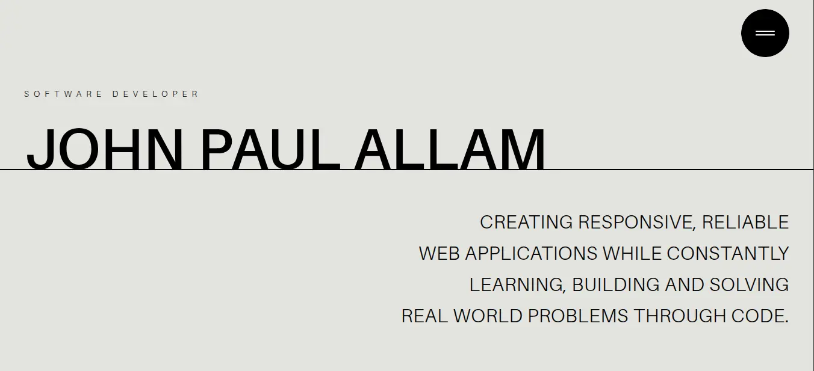

# John Paul Allam — Software Developer



Personal portfolio. One long scrolling page where GSAP ScrollTrigger drives
almost every transition.

<!-- TODO: this currently points at a different (Next.js) site, not this repo. -->
**[Live site](https://jpallam.vercel.app)** · **[GitHub](https://github.com/jpallam09)** · **[LinkedIn](https://www.linkedin.com/in/johnpaulallam/)**

## What it is

A single-page React 19 app. There are no routes — the whole thing is one
vertical scroll through eight sections, and the animations are what make it
worth scrolling. Tailwind v4 handles layout and the display type scale, Lenis is
mounted at the root for smooth scrolling, and the Amiamie display face is
self-hosted rather than pulled from a font CDN.

Everything animated is written against one GSAP instance, so nothing depends on
import order.

## Animations

Each of these is implemented in `src/`, not described aspirationally:

| Effect | Where | Technique |
|---|---|---|
| Section header entrance | `components/AnimatedHeaderSection.tsx` | Timeline: wrapper slides up from `50vh`, title fades in at `<+0.2` behind it |
| Line-by-line paragraph reveal | `components/AnimatedTextLines.tsx` | Text is split on `\n` into spans, each `gsap.from`'d with a `stagger` |
| Infinite scroll-velocity marquee | `components/Marquee.tsx` | One long timeline that wraps items off-screen, `Observer` retargets `timeScale` from scroll velocity |
| Full-screen menu | `sections/Navbar.tsx` | `paused: true` timeline, played to open and reversed to close |
| Burger to cross | `sections/Navbar.tsx` | Two bars rotated `±45deg` around `origin-center` |
| Hide chrome on scroll down | `sections/Navbar.tsx` | `window` scroll listener comparing against `lastScrollY` |
| Page-wide horizontal drift | `sections/SkillsSummary.tsx` | Four rows scrubbed sideways by `xPercent`, with no `trigger` |
| Stacked sticky cards | `sections/Skills.tsx` | CSS `position: sticky` with computed `top`/`marginBottom`, tallest-card height sync on resize |
| Per-card reveal | `sections/Skills.tsx` | Each card gets its own `scrollTrigger` so they animate independently |
| Scrubbed section scale | `sections/About.tsx` | Section shrinks to `0.95` between `bottom 80%` and `bottom 20%`, reverses on scroll-up |
| `clip-path` image reveal | `sections/About.tsx` | Image un-collapses from a flat line, so it is never resampled or reflowed |
| Staggered project rows | `sections/Projects.tsx` | One trigger on the list, `stagger` cascade |
| Hover curtain wipe | `sections/Projects.tsx` | `fromTo` on a `clip-path` polygon plus `killTweensOf`, so fast pointer movement can't leave the overlay stuck |
| Weighted mouse follower | `sections/Projects.tsx` | `gsap.quickTo` with mismatched durations (1.5s on x, 2s on y) so the preview trails with a sense of weight |
| Tech-stack logo strip | `sections/Projects.tsx` | The marquee again, with `renderItem` drawing monochrome `simple-icons` glyphs instead of words |
| Pinned section | `sections/ContactSummary.tsx` | `pin: true`, `scrub: 0.5`, `start: "center center"`, `end: "+=800 center"` |
| Social links reveal | `sections/Contact.tsx` | Three blocks slide up one after another |

## Sections

`src/App.tsx` renders these in order:

| `id` | Component | What it does |
|---|---|---|
| — | `Navbar` | Off-canvas menu and the burger toggle |
| `home` | `Hero` | Name and intro copy |
| — | `SkillsSummary` | Keyword rows that drift sideways as you scroll |
| `projects` | `Projects` | Featured projects with a cursor-following preview, and a tech-stack logo marquee |
| `skills` | `Skills` | Four skill cards that stick and stack |
| `about` | `About` | Bio and portrait |
| — | `ContactSummary` | Pinned marquee and tagline |
| `contact` | `Contact` | Email, phone, and social links |

The `id` values are what the Navbar links and `react-scroll` target, so adding a
section means updating both.

## Stack

| | |
|---|---|
| React | 19, with `StrictMode` |
| TypeScript | 5.9, `strict` |
| Vite | 6 |
| Tailwind | v4 via `@tailwindcss/vite` |
| GSAP | 3, with ScrollTrigger and Observer |
| Lenis | smooth scroll, mounted at the root |
| Icons | Iconify |

## Running it

Needs Node `^18 || ^20 || >=22` and pnpm.

```bash
pnpm install
pnpm dev
```

| Script | What it does |
|---|---|
| `pnpm dev` | Vite dev server with HMR |
| `pnpm build` | `tsc -b && vite build` — typecheck, then production build |
| `pnpm typecheck` | `tsc -b` alone |
| `pnpm lint` | `eslint .` |
| `pnpm preview` | Serve the production build |

Both `build` and `lint` are expected to be clean. `strict` is on, so a field
rename in the data is a compile error rather than a runtime `undefined`.

## Layout

```
src/
  App.tsx            section order
  main.tsx           React root
  components/        AnimatedHeaderSection, AnimatedTextLines, Marquee
  constants/         skillsData, projects, socials + their types
  lib/gsap.ts        the one registerPlugin call
  sections/          one file per section
  index.css          theme and the @utility type scale
public/
  assets/projects/   project thumbnails
  fonts/amiamie/     self-hosted display type
  images/            portrait
doc/
  GSAP-PATTERNS.md   every animation, with the reasoning
  skill/             18 copy-pasteable recipes
```

There is no `tailwind.config.js`. The theme and the responsive type helpers
(`banner-`, `value-`, `marquee-`, `contact-text-responsive`) are `@utility`
blocks in `src/index.css`.

## Animation docs

- [`doc/GSAP-PATTERNS.md`](doc/GSAP-PATTERNS.md) — every animation on the site
  and why it is built the way it is, plus the Lenis/ScrollTrigger write-up.
- [`doc/skill/`](doc/skill/README.md) — the same material as 18 self-contained
  recipes, each with full code and a "done when" checklist. Start with
  `gsap-scaffold`.

## Gotchas

Things that break the page rather than erroring:

- **Import GSAP and its plugins from `src/lib/gsap.ts`.** That is the only
  `registerPlugin(ScrollTrigger, Observer)` call, so no file depends on another
  having been imported first.
- **Keep marquee word lists in `src/constants`.** The `Marquee` effect keys off
  `[items, reverse]`, so an array literal written inline in JSX is a new
  identity every render and restarts the loop on every unrelated re-render.
- **Section copy for `AnimatedTextLines` must be a multi-line template
  literal.** It splits on `\n`; a single-line string collapses the animation
  into one block.
- **`SkillsSummary` rows deliberately have no `trigger`.** A triggerless
  ScrollTrigger spans the whole page, which keeps the `xPercent` drift in
  range. Adding `start`/`end` pushes the words off screen.
- **The `Skills` cards are CSS sticky, not GSAP-pinned.** Don't also pin or
  scrub them.
- **Lenis is mounted but not bridged to ScrollTrigger** — there is no
  `lenis.on("scroll", ScrollTrigger.update)` anywhere. Scrolling currently falls
  back to native, which the one `pin` handles correctly. The naive bridge can
  leave the page unscrollable; read `doc/GSAP-PATTERNS.md` before adding it.
